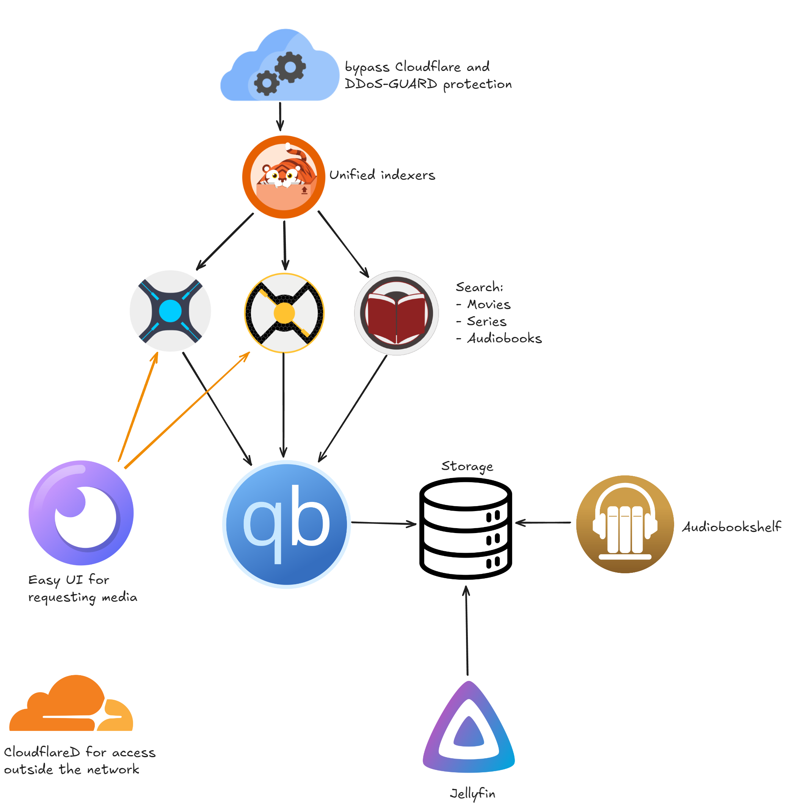

# Media server

A media server system for hosting 
- Movies
- TV Shows
- Audio books

# Layout

# Hardware encondig

The default docker-compose file is made to work with the rockchip VPU, If you want to run any other devices you can look at [jellyfin's handy manual](https://jellyfin.org/docs/general/administration/hardware-acceleration/)

# Acknowledgements

This project is based of [Morzomb's media server](https://github.com/Morzomb/All-jellyfin-media-server) but more streamlined